# Event Ticketing Platform


## Summary
A web-based platform enabling users to create events, manage ticket sales, and generate QR-coded tickets for attendees, streamlining the event management and ticket distribution process.

## Definitions

### Event
A planned gathering or occasion with a specific date, time, and venue that requires ticketing for attendance management.

### Ticket
A digital or physical document that grants the holder access to an event, containing event details and a unique QR code for validation.

### QR Code
A machine-readable code consisting of black and white squares, used to store ticket information and verify authenticity at event entry.

## User Stories

### Create Event
As an event organizer  
I want to create and configure a new event with details like date, venue, and ticket types  
So that I can start selling tickets to attendees

#### Acceptance Criteria
1. Organizer can input event name, date, time, and venue
2. Organizer can set multiple ticket types with different prices
3. Organizer can specify total available tickets per type
4. Event appears on the platform after creation
5. Organizer receives confirmation email with event details

### Manage Ticket Sales
As an event organizer  
I want to monitor and manage ticket sales  
So that I can track revenue and attendance

#### Acceptance Criteria
1. Dashboard displays real-time sales metrics
2. Organizer can view purchaser details
3. Organizer can export sales reports
4. System prevents overselling of tickets
5. Sales automatically stop at specified end date

### Validate Tickets
As an event staff member  
I want to scan attendee QR codes at entry  
So that I can verify ticket authenticity

#### Acceptance Criteria
1. Staff can scan QR codes using mobile device
2. System displays ticket validity status instantly
3. System prevents duplicate ticket use
4. Staff can manually input ticket numbers if QR scan fails

## Bonus Features
* Event analytics dashboard for attendee demographics and sales trends
* Automated email marketing system for event promotion and attendee communication

## Class Diagram
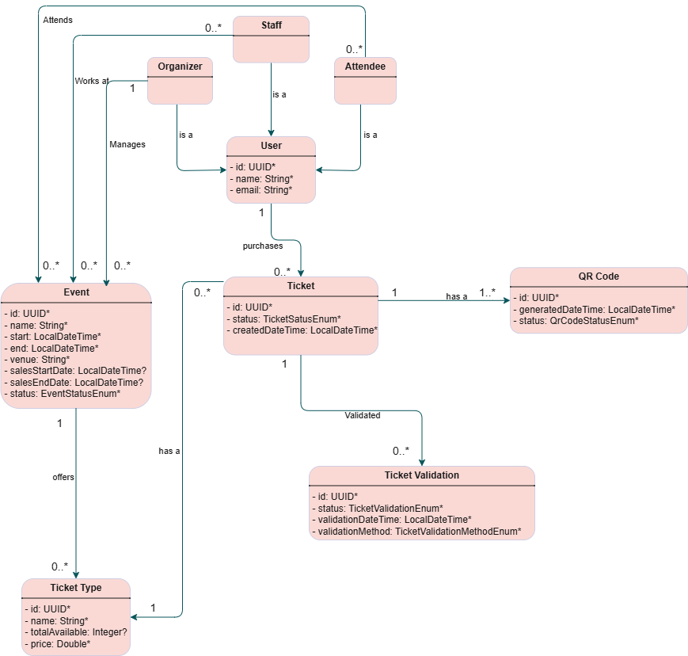

## Front-end and backend connection
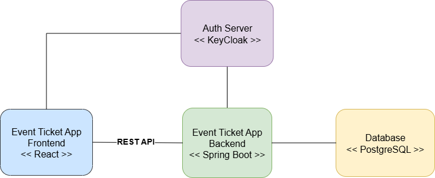

## Screenshots

Landing page event ticket platform
#### The main landing page where users can browse available events.
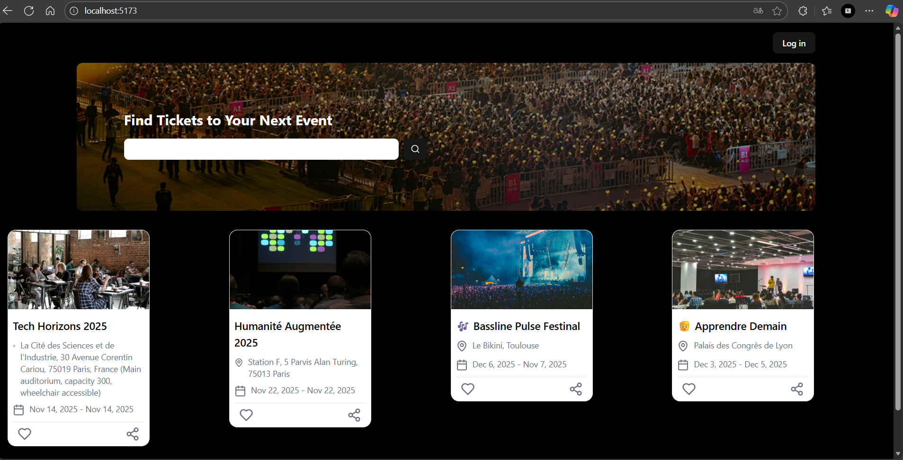

#### Secure login page for organizers and staff members.
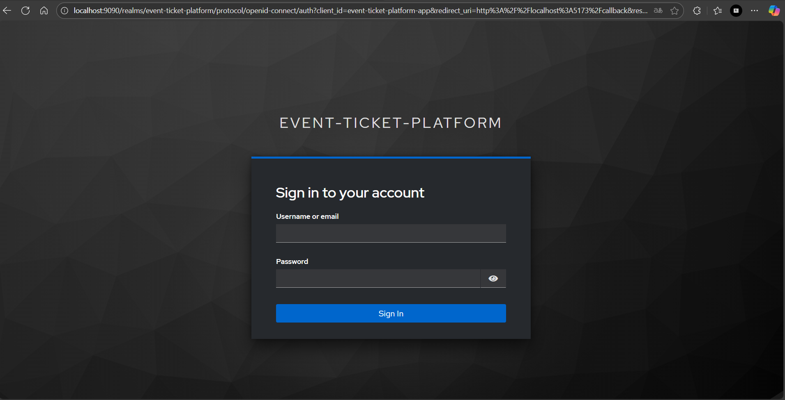

#### Dashboard overview for organizers after login.
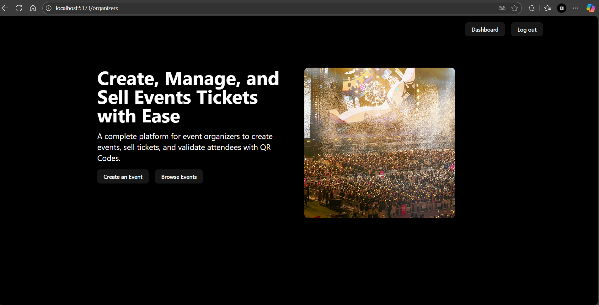

#### Form to create new events with date, venue, and ticket settings.
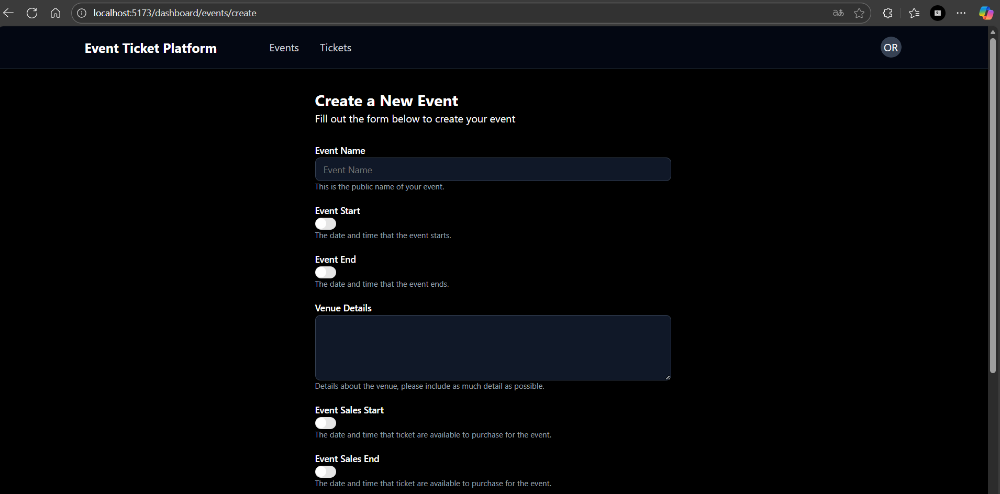

#### Detailed view of a specific event with ticket sales metrics.
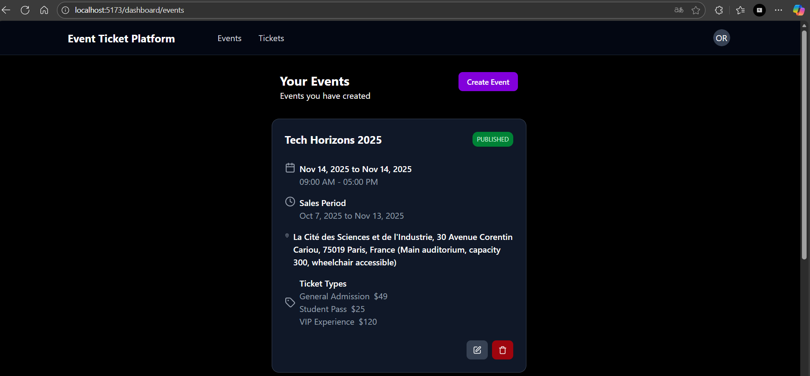

#### Page showing event information and ticket availability.
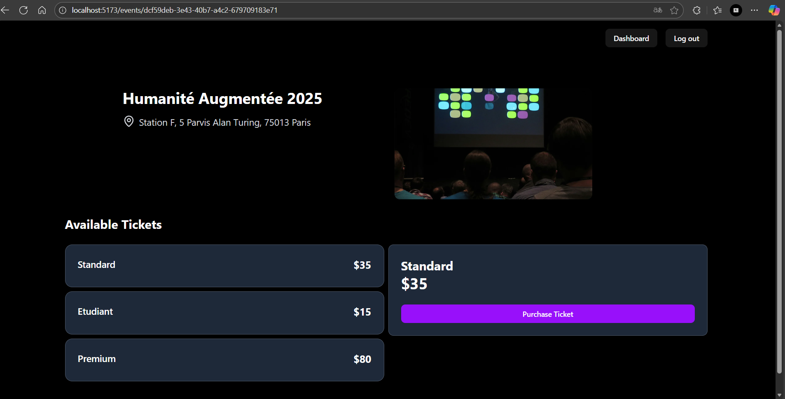

#### Form for users to purchase a ticket.
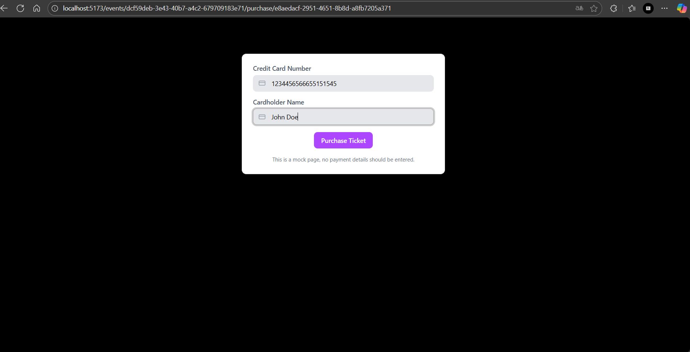

#### Overview of all purchased tickets for a user.
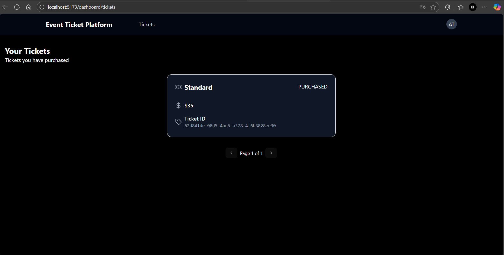

#### Confirmation page displayed after a successful purchase.
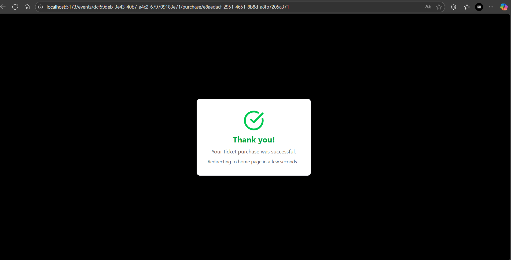

#### QR-coded ticket sent to the user for entry validation.
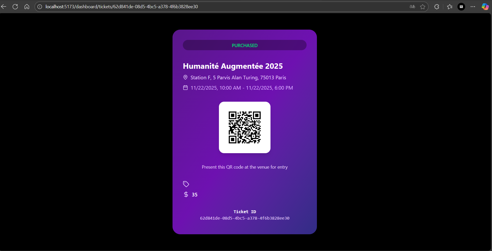

Staff member validate QR code
#### Staff interface to scan and validate tickets efficiently.


First time validation QR code
#### Initial validation of an attendee's ticket at entry.
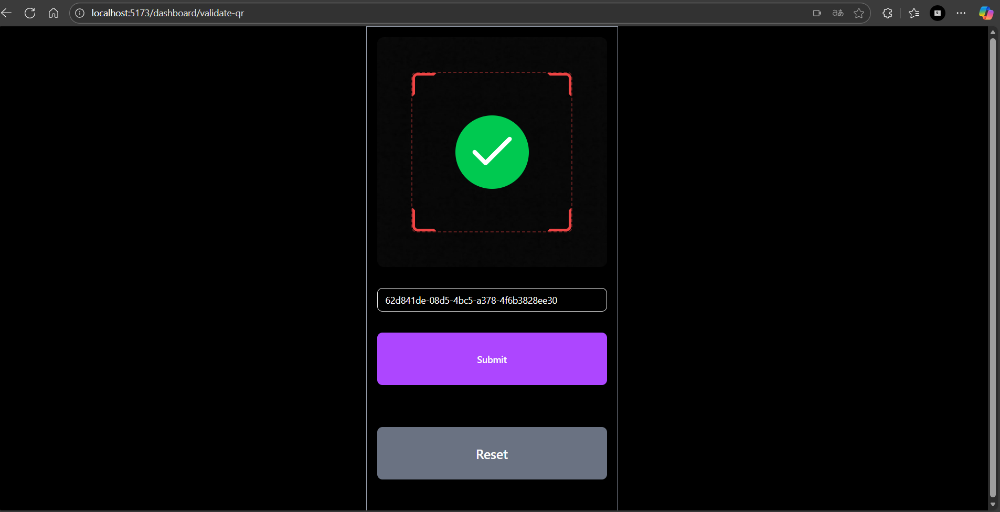

Second time validation QR code
#### System preventing a duplicate scan of the same ticket.
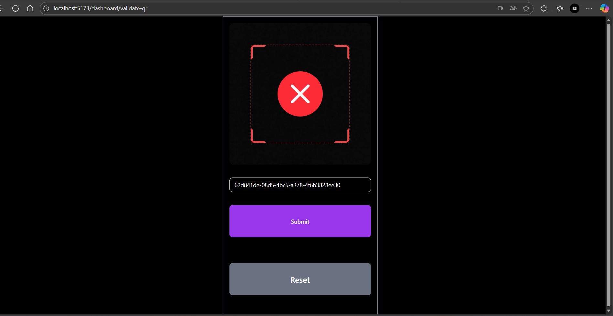

Perfect! We can add an **Installation** section in your README in English using your provided commands. Here’s a polished Markdown version:


## Installation

Follow these steps to set up and run the project locally.

### Prerequisites
- Node.js and npm installed
- Git

### 1. Clone the project

```bash
git clone https://github.com/PatriceAlan/event-ticket-platform.git
cd event-ticket-platform
````

## Docker Setup

The project provides a `docker-compose.yml` file to run all necessary services, including PostgreSQL, Adminer, and Keycloak.

### 1. Start Docker Services
Run the following command in the project root (where `docker-compose.yml` is located):

```bash
docker-compose up -d
```

This will start the following services:

- **PostgreSQL database**
    - Image: `postgres:latest`
    - Ports: `5432:5432`
    - Password in Dockerfile

- **Adminer (database management interface)**
    - Image: `adminer:latest`
    - Ports: `8888:8080`
    - Access via [http://localhost:8888](http://localhost:8888)

- **Keycloak (authentication server)**
    - Image: `quay.io/keycloak/keycloak:latest`
    - Ports: `9090:8080`
    - Admin credentials are in the Dockerfile
    - Persistent data stored in the `keycloak-data` Docker volume
    - Runs in development mode with an embedded file-based database (`--db=dev-file`)


### 2. Install dependencies for frontend

```bash
npm install --force
```

> The `--force` flag is required due to `shadcn` dependency conflicts.

### 3. Start the development server

```bash
npm run dev
```

The frontend development server will start, typically available at [http://localhost:5173](http://localhost:5173).


